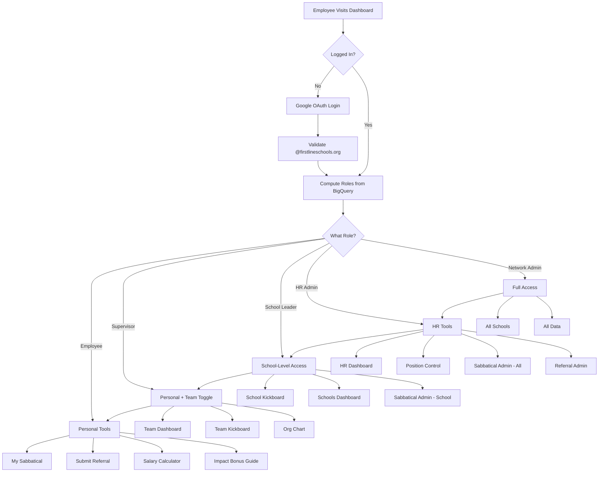
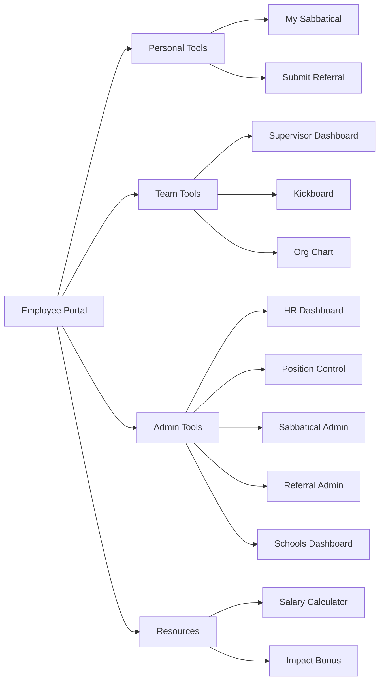

# FirstLine Schools - Unified Employee Dashboard Plan

## Vision
A single Employee Dashboard where every FirstLine employee logs in once and sees everything they need based on their role. Supervisors can toggle between personal and team views.

---

## Current Application Landscape

| App | Purpose | Auth | Users |
|-----|---------|------|-------|
| **bigquery-dashboards** | Supervisor/HR/Kickboard/Schools/OrgChart | OAuth + hierarchy | All staff |
| **sabbatical-program** | Sabbatical applications & approvals | OAuth + role | All staff |
| **position-control** | Position management & validation | OAuth + admin | HR/Talent |
| **referral-program** | Staff referral tracking | OAuth + admin/public | All staff |
| **salary-scale** | Salary calculator | None (public) | All staff |
| **impact-bonus** | Bonus information guide | None (public) | All staff |

---

## Proposed Dashboard Structure

```
+------------------------------------------------------------------+
|  [FirstLine Logo]   Employee Dashboard    [Scott Shirey | Logout] |
+------------------------------------------------------------------+
|                                                                   |
|  Welcome, Scott!                    [ Personal | Team ] toggle    |
|  Chief People Officer at Network                                  |
|                                                                   |
+------------------------------------------------------------------+
|                                                                   |
|  MY TOOLS                                                         |
|  +-------------+  +-------------+  +-------------+                |
|  | My Team     |  | My          |  | Submit      |                |
|  | Dashboard   |  | Sabbatical  |  | Referral    |                |
|  +-------------+  +-------------+  +-------------+                |
|                                                                   |
|  RESOURCES                                                        |
|  +-------------+  +-------------+                                 |
|  | Salary      |  | Impact      |                                 |
|  | Calculator  |  | Bonus Guide |                                 |
|  +-------------+  +-------------+                                 |
|                                                                   |
|  ADMIN TOOLS (shown based on role)                                |
|  +-------------+  +-------------+  +-------------+  +-------------+
|  | HR          |  | Position    |  | Sabbatical  |  | Referral    |
|  | Dashboard   |  | Control     |  | Admin       |  | Admin       |
|  +-------------+  +-------------+  +-------------+  +-------------+
|  +-------------+  +-------------+  +-------------+                |
|  | Schools     |  | Kickboard   |  | Org Chart   |                |
|  | Dashboard   |  | Dashboard   |  |             |                |
|  +-------------+  +-------------+  +-------------+                |
|                                                                   |
+------------------------------------------------------------------+
```

---

## Unified Role Hierarchy

| Role | Who | Access |
|------|-----|--------|
| **Network Admin** | C-Team, HR Leadership (sshirey, brichardson, spence, etc.) | Everything |
| **HR Admin** | Talent team, HR staff | HR tools, Sabbatical admin, Referral admin |
| **Academic Admin** | ExDir T&L, Content Leads (kfeil, etc.) | Schools dashboard, teacher data |
| **School Leader** | Principals, APs, Deans | Their school's data, Kickboard, Sabbatical (school) |
| **Supervisor** | Anyone with direct reports | Team dashboard, team Kickboard |
| **Employee** | All staff | Personal tools, Sabbatical app, Referral submit, Resources |

---

## Tool Visibility Matrix

| Tool | Employee | Supervisor | School Leader | HR Admin | Network Admin |
|------|----------|------------|---------------|----------|---------------|
| My Team Dashboard | - | Own team | School | All | All |
| My Sabbatical | Yes | Yes | Yes | Yes | Yes |
| Submit Referral | Yes | Yes | Yes | Yes | Yes |
| Salary Calculator | Yes | Yes | Yes | Yes | Yes |
| Impact Bonus Guide | Yes | Yes | Yes | Yes | Yes |
| HR Dashboard | - | - | - | Yes | Yes |
| Position Control | - | - | - | Yes | Yes |
| Sabbatical Admin | - | - | School only | All | All |
| Referral Admin | - | - | - | Yes | Yes |
| Schools Dashboard | - | - | By role | By role | All |
| Kickboard | - | Team | School | All | All |
| Org Chart | - | Yes | Yes | Yes | Yes |

---

## User Flow Diagram



### Navigation Flow



---

## Technical Approach

### Recommendation: Extend bigquery-dashboards as the foundation

**Why:**
- Already has mature OAuth + domain validation
- Complex hierarchy-based permissions already work
- Blueprint architecture ready for expansion
- Most sophisticated access control patterns

### Integration Strategy

| App | Method |
|-----|--------|
| bigquery-dashboards | Base application (keep as-is, add portal) |
| sabbatical-program | Migrate as new blueprint |
| position-control | Migrate as new blueprint |
| referral-program | Migrate as new blueprint |
| salary-scale | Add as static HTML route |
| impact-bonus | Add as static HTML route |

---

## URL Structure

```
/                          # Employee Portal (new main dashboard)
/my-team                   # Supervisor dashboard (renamed from /)
/my-sabbatical             # User's sabbatical view
/submit-referral           # Referral submission form
/salary-calculator         # Salary scale tool
/impact-bonus              # Bonus information

# Admin Tools
/hr-dashboard              # HR/Talent dashboard
/position-control          # Position control
/sabbatical-admin          # Sabbatical management
/referral-admin            # Referral management
/schools-dashboard         # Schools team dashboard
/kickboard-dashboard       # Kickboard dashboard
/orgchart                  # Org chart
```

---

## Implementation Phases

### Phase 1: Portal Foundation (Week 1)
- Create new `portal.py` blueprint with main dashboard
- Add `/api/portal/user-info` endpoint returning role + available tools
- Create `portal.html` with tool cards
- Consolidate admin email lists in `config.py`

### Phase 2: Static Tools (Week 1)
- Add salary-scale HTML as static route
- Add impact-bonus HTML as static route
- Link from portal

### Phase 3: Referral Migration (Week 2)
- Create `referral.py` blueprint from referral-program app.py
- Share OAuth session
- Keep public submission endpoint

### Phase 4: Sabbatical Migration (Week 2-3)
- Create `sabbatical.py` blueprint from sabbatical-program app.py
- Integrate with unified role system
- Both user and admin views

### Phase 5: Position Control Migration (Week 3)
- Create `position_control.py` blueprint
- Use shared admin checks

### Phase 6: Deploy & Redirect (Week 4)
- Deploy unified dashboard
- Set up redirects from old app URLs
- Update OAuth redirect URIs
- Monitor and fix issues

---

## Key Files to Modify

| File | Changes |
|------|---------|
| `bigquery_dashboards/app.py` | Register new portal blueprint |
| `bigquery_dashboards/config.py` | Add unified ADMIN_TIERS, tool definitions |
| `bigquery_dashboards/auth.py` | Add `compute_user_roles()`, `get_available_tools()` |
| `bigquery_dashboards/blueprints/portal.py` | NEW - main dashboard routes |
| `bigquery_dashboards/templates/portal.html` | NEW - dashboard UI |

---

## Supervisor Toggle Design

The toggle allows supervisors to switch views:

- **Personal**: See their own data (as an employee)
- **Team**: See their direct reports' data (as a supervisor)

```
[ Personal | Team ]
     ^
  Currently selected
```

Backend already supports this via `accessible_supervisors` list in session.

---

## Demo Strategy (Before Go-Live)

### Option 1: Local Development (Quick Testing)
```bash
cd bigquery_dashboards
set FLASK_ENV=development
python app.py
# Opens at http://localhost:5000
```
- Uses dev mode with auto-login as sshirey@firstlineschools.org
- No OAuth needed locally
- Fast iteration on UI changes

### Option 2: Dev Cloud Run Deployment (Recommended for Sharing)
```bash
gcloud run deploy employee-dashboard-dev --source . --region us-central1 --project talent-demo-482004 --allow-unauthenticated
```
- Creates separate URL: `employee-dashboard-dev-xxxxx.us-central1.run.app`
- Real OAuth works - test with actual users
- Share with select stakeholders for feedback
- Keep existing apps running at their current URLs
- No disruption to current workflows

### Option 3: Feature Flag / Beta Route
- Add `/portal-beta` route to existing app
- Only show to specific test users (check email against beta list)
- Gradually roll out by adding emails to beta list
- Flip switch when ready for everyone

### Recommended Approach
1. Build Phase 1-2 locally
2. Deploy as `employee-dashboard-dev` for stakeholder review
3. Gather feedback from Operations, Finance, Dev/Comm
4. Iterate based on feedback
5. When approved, deploy as main `employee-dashboard`
6. Set up redirects from old app URLs

---

## Verification Plan

1. **Auth Test**: Login as different user types, verify correct tools shown
2. **Role Test**: Check each tool respects permissions
3. **Toggle Test**: Supervisor toggle switches data correctly
4. **Navigation Test**: All links work, back button works
5. **Mobile Test**: Responsive layout on phone/tablet
6. **Redirect Test**: Old URLs redirect to new portal

---

## Benefits

1. **Single Login**: One place for everything
2. **Role-Based**: See only what you need
3. **Consistent UX**: Same look/feel across all tools
4. **Easier Maintenance**: Single codebase
5. **Better Security**: Unified auth, centralized admin lists

---

## Future Considerations (To Be Defined)

### Additional Teams to Include

| Team | Potential Tools/Access | Notes |
|------|----------------------|-------|
| **Operations Team** | Facilities, maintenance tracking, vendor management? | TBD |
| **Finance Department** | Budget dashboards, payroll oversight, financial reports? | TBD |
| **Dev/Comm (Development & Communications)** | Donor tracking, event management, communications calendar? | TBD |
| **Academic Teams** | Additional layers beyond Schools Dashboard? | TBD |

### Questions to Consider

1. What tools do Operations, Finance, and Dev/Comm currently use?
2. Are there existing systems that should integrate vs. new tools to build?
3. What data sources exist for these departments in BigQuery?
4. What are the role hierarchies within these teams?
5. Cross-department access needs (e.g., Finance viewing HR data)?

---

## Document History

| Date | Version | Notes |
|------|---------|-------|
| 2026-02-08 | Draft 1.0 | Initial plan covering HR/Talent tools |
| | | Pending: Operations, Finance, Dev/Comm requirements |
